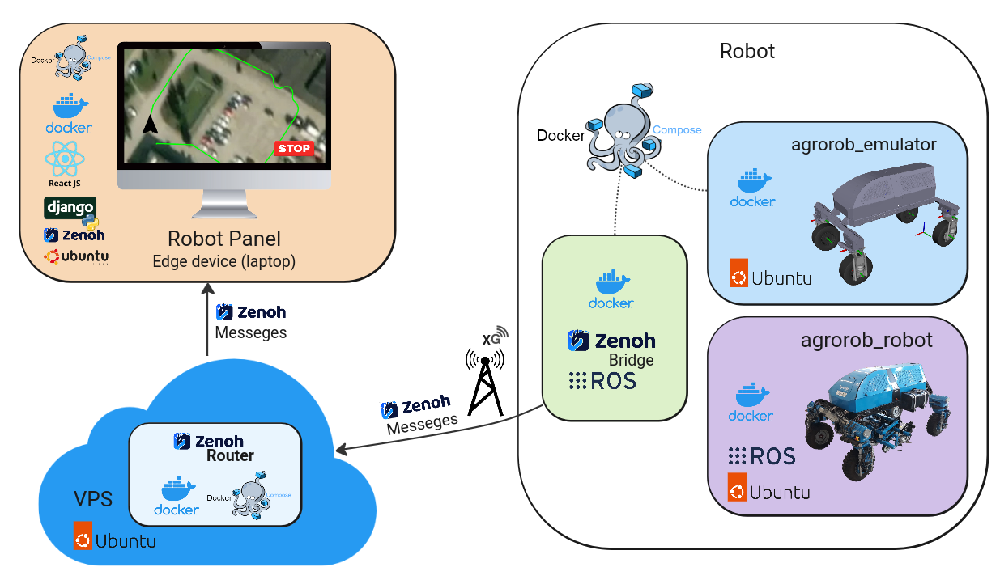

# Agrorob deployment using containers 

## agrorob_driver:

#### Install Docker Desktop:

https://www.docker.com/products/docker-desktop/

After running Docker Desktop install WSL2 addition (there will be a pop-up window).

#### In a directory with DockerFile build a docker image:

```docker build -t agrorob_driver .```


#### Allow for connections for GUI

```xhost +``` 

#### Run docker image with command:

```docker run --net=host --cap-add SYS_NICE -e DISPLAY=$DISPLAY -v /tmp/.X11-unix -it agrorob_driver```


#### validation:
After connecting to docker, run below command to verify packages are installed

```ros2 pkg list ```


## agrorob_emulator 


### Prerequisites

Make sure you have Docker and Docker Compose installed on your machine. You can download them from the [official Docker website](https://www.docker.com/get-started).

### Clone the Repository

```bash
git clone https://github.com/icos-pit/agrorob_docker_image
cd AGROROB_ROSBAG_IMAGE

```

### Build the Docker Image

```bash
docker compose build

```

### Run the Docker Container

```bash
docker compose up

```
### Customization

Feel free to customize the Dockerfile and docker-compose.yml files to suit your project's specific requirements. Update the application code, configuration, or any other aspects as needed.

### Stopping the Container
To stop the Docker container, press Ctrl + C in the terminal where the container is running.